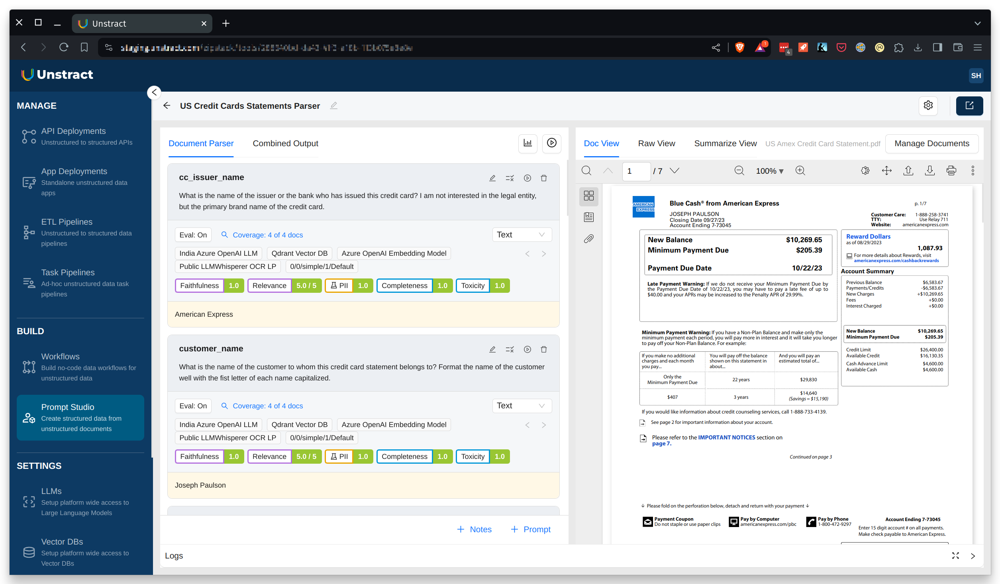
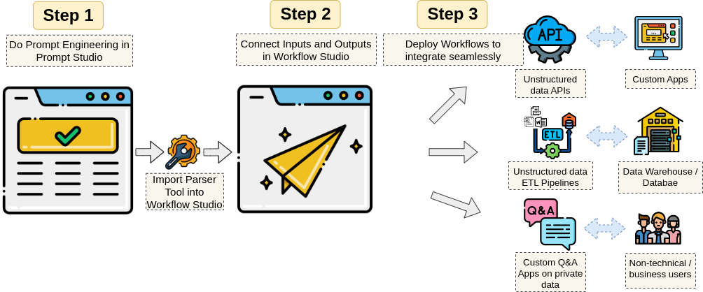

# Unstract

## No-code LLM Platform to launch APIs and ETL Pipelines to structure unstructured documents

## 🤖 Go beyond co-pilots

While co-pilots enable machine-to-human automation, with Unstract, you can go beyond co-pilots by enabling machine-to-machine automation. You can launch APIs that take in complex documents and return structured JSON all with a simple no-code approach. You can also launch unstructured data ETL Pipelines that can read complex documents from a variety of cloud file / object storage systems and write structured data into popular data warehouses and databases.

## 🧘‍♀️ Three step nirvana

Automate critical business processes that involve complex documents with a human in the loop. Go beyond RPA with the power of Large Language Models.

🌟 **Step 1**: Add documents to no-code Prompt Studio and do prompt engineering to extract required fields  
🌟 **Step 2**: Configure Prompt Studio project as API deployment or configure input source and output destination for ETL Pipeline 
🌟 **Step 3**: Deploy Workflows as unstructured data APIs or unstructured data ETL Pipelines!

## 🚀 Getting started

The easiest way to get started is with Docker. Clone this repo and do the following:

✅ `./run-platform.sh` 
✅ Now visit [http://frontend.unstract.localhost](http://frontend.unstract.localhost) in your browser  
✅ Use user name and password `unstract` to login

That's all there is to it!

## ⏩ Quick Start Guide

Unstract comes well documented. You can get introduced to the [basics of Unstract](https://docs.unstract.com/), and [learn how to connect](https://docs.unstract.com/unstract_platform/setup_accounts/whats_needed) various systems like LLMs, Vector Databases, Embedding Models and Text Extractors to it. The easiest way to wet your feet is to go through our [Quick Start Guide](https://docs.unstract.com/unstract_platform/quick_start) where you actually get to do some prompt engineering in Prompt Studio and launch an API to structure varied credit card statements!

## 🙌 Contributing

Contributions are welcome! Please read [CONTRIBUTE.md](CONTRIBUTE.md) for further details on setting up the development environment, etc. It also points you to other detailed documents as needed.

## 👋 Join the LLM-powered automation community
