

# Unstract

## No-code LLM Platform to launch APIs and ETL Pipelines to structure unstructured documents

##

## 🤖 Prompt Studio

Prompt Studio's primary reason for existence is so you can develop the necessary prompts for document data extraction super efficiently. It is a purpose-built environment that makes this not just easy for you—but, lot of fun! The document sample, its variants, the prompts you're developing, outputs from different LLMs, the schema you're developing, costing details of the extraction and various tools that let you measure the effectiveness of your prompts are just a click away and easily accessible. Prompt Studio is designed for effective and high speed development and iteration of prompts for document data extraction. Welcome to IDP 2.0!

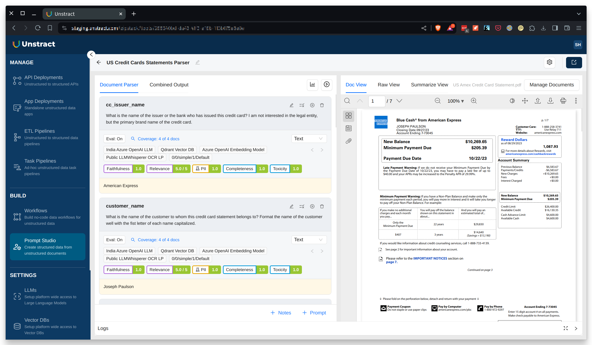

## 🧘‍♀️ Three step nirvana with Workflow Studio

Automate critical business processes that involve complex documents with a human in the loop. Go beyond RPA with the power of Large Language Models.

🌟 **Step 1**: Add documents to no-code Prompt Studio and do prompt engineering to extract required fields  
🌟 **Step 2**: Configure Prompt Studio project as API deployment or configure input source and output destination for ETL Pipeline 
🌟 **Step 3**: Deploy Workflows as unstructured data APIs or unstructured data ETL Pipelines!

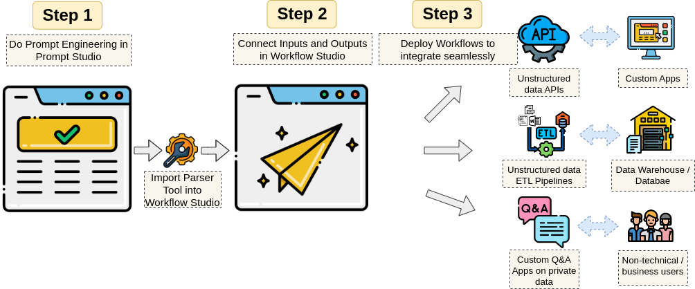

## 🚀 Getting started

### System Requirements

- 8GB RAM (recommended)

### Prerequisites

- Linux or MacOS (Intel or M-series)
- Docker
- Docker Compose (if you need to install it separately)
- Git

Next, either download a release or clone this repo and do the following:

✅ `./run-platform.sh` 
✅ Now visit [http://frontend.unstract.localhost](http://frontend.unstract.localhost) in your browser  
✅ Use username and password `unstract` to login

That's all there is to it!

Follow [these steps](backend/README.md#authentication) to change the default username and password.
See [user guide](https://docs.unstract.com/unstract/unstract_platform/user_guides/run_platform) for more details on managing the platform.

Another really quick way to experience Unstract is by signing up for our [hosted version](https://us-central.unstract.com/). It comes with a 14 day free trial!

## 📄 Supported File Types

Unstract supports a wide range of file formats for document processing:

| Category | Format | Description |
|----------|---------|-------------|
| **Word Processing** | DOCX | Microsoft Word Open XML |
| | DOC | Microsoft Word |
| | ODT | OpenDocument Text |
| **Presentation** | PPTX | Microsoft PowerPoint Open XML |
| | PPT | Microsoft PowerPoint |
| | ODP | OpenDocument Presentation |
| **Spreadsheet** | XLSX | Microsoft Excel Open XML |
| | XLS | Microsoft Excel |
| | ODS | OpenDocument Spreadsheet |
| **Document & Text** | PDF | Portable Document Format |
| | TXT | Plain Text |
| | CSV | Comma-Separated Values |
| | JSON | JavaScript Object Notation |
| **Image** | BMP | Bitmap Image |
| | GIF | Graphics Interchange Format |
| | JPEG | Joint Photographic Experts Group |
| | JPG | Joint Photographic Experts Group |
| | PNG | Portable Network Graphics |
| | TIF | Tagged Image File Format |
| | TIFF | Tagged Image File Format |
| | WEBP | Web Picture Format |

## ⏩ Quick Start Guide

Unstract comes well documented. You can get introduced to the [basics of Unstract](https://docs.unstract.com/unstract/), and [learn how to connect](https://docs.unstract.com/unstract/unstract_platform/setup_accounts/whats_needed) various systems like LLMs, Vector Databases, Embedding Models and Text Extractors to it. The easiest way to wet your feet is to go through our [Quick Start Guide](https://docs.unstract.com/unstract/unstract_platform/quick_start) where you actually get to do some prompt engineering in Prompt Studio and launch an API to structure varied credit card statements!

## 🤝 Ecosystem support

### LLM Providers

|| Provider                                                       | Status                      |
|----------------------------------------------------------------|-----------------------------|---|
|        | OpenAI                      | ✅ Working |
| 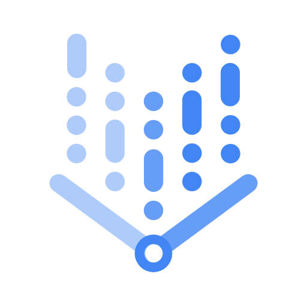    | Google VertexAI, Gemini Pro | ✅ Working |
|  | Azure OpenAI                | ✅ Working |
|     | Anthropic                   | ✅ Working |
|        | Ollama                      | ✅ Working |
|       | Bedrock                     | ✅ Working |
| 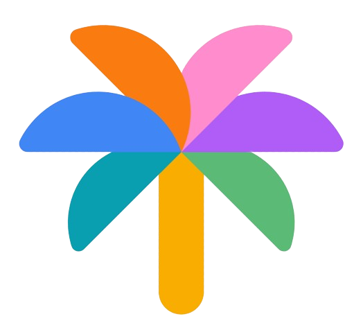         | Google PaLM                 | ✅ Working |
|      | Anyscale                    | ✅ Working |
|    | Mistral AI                  | ✅ Working |

### Vector Databases

|| Provider | Status |
|---|---|---|
|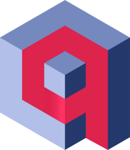| Qdrant | ✅ Working |
|| Weaviate | ✅ Working |
|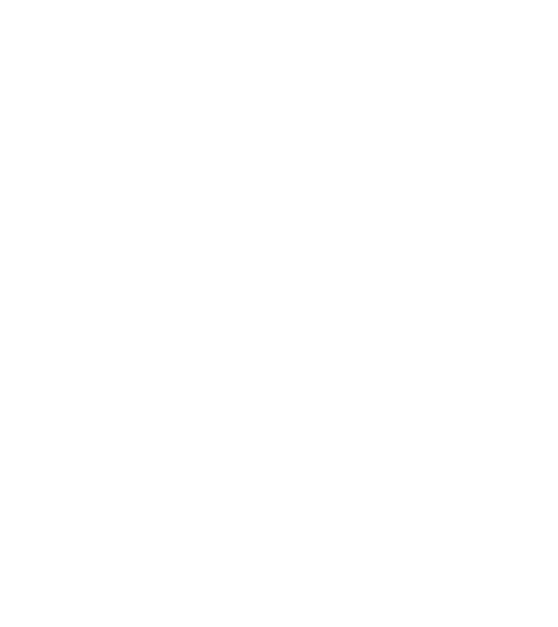| Pinecone | ✅ Working |
|| PostgreSQL | ✅ Working |
|| Milvus | ✅ Working |

### Embeddings

|| Provider | Status |
|---|---|---|
|| OpenAI | ✅ Working |
|| Azure OpenAI | ✅ Working  |
|| Google PaLM | ✅ Working  |
|| Ollama | ✅ Working |
|    | VertexAI | ✅ Working |
|       | Bedrock                     | ✅ Working |

### Text Extractors

|| Provider                   | Status |
|---|----------------------------|---|
|| Unstract LLMWhisperer V2   | ✅ Working |
|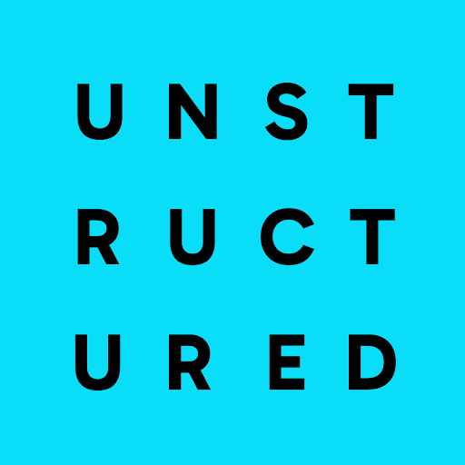| Unstructured.io Community  | ✅ Working |
|| Unstructured.io Enterprise | ✅ Working |
|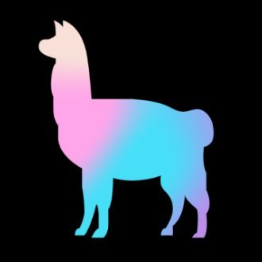| LlamaIndex Parse           | ✅ Working |

### ETL Sources

|| Provider | Status |
|---|---|---|
|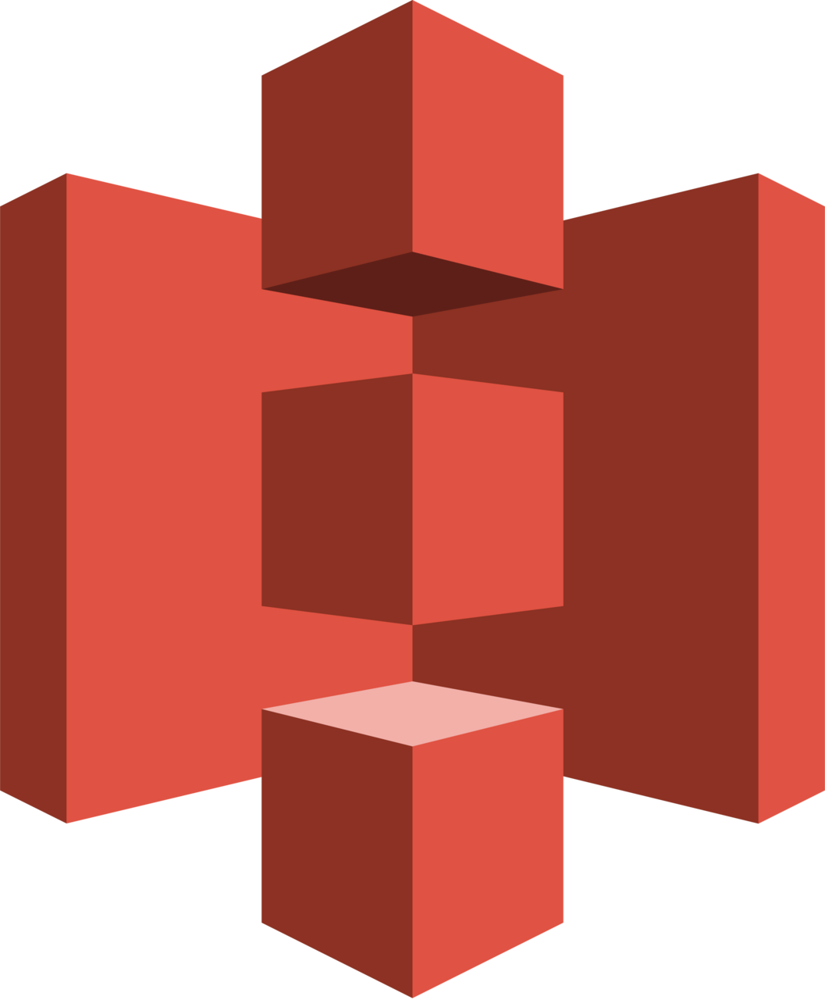| AWS S3 | ✅ Working |
|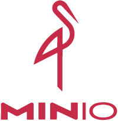| MinIO | ✅ Working |
|| Google Cloud Storage | ✅ Working |
|| Azure Cloud Storage | ✅ Working |
|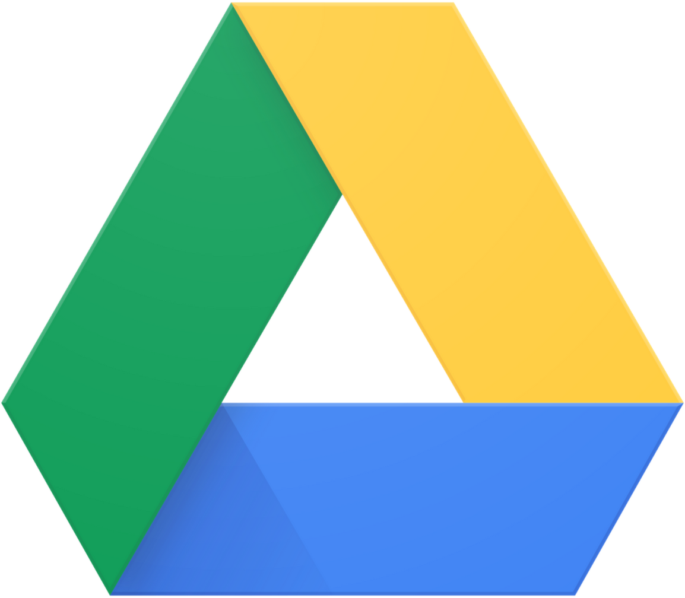| Google Drive | ✅ Working |
|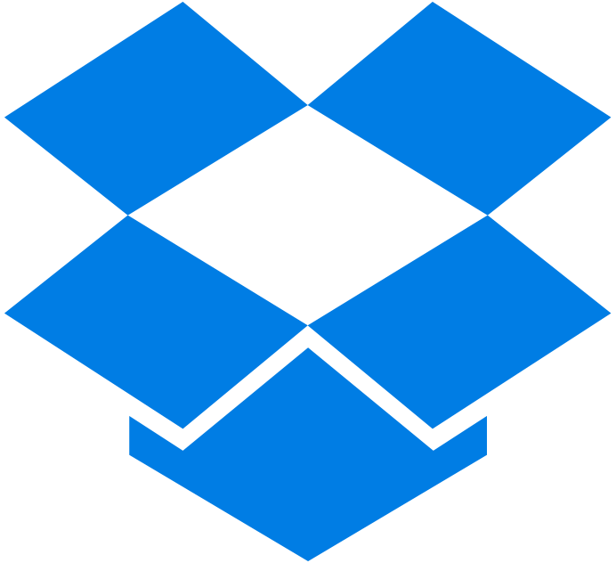| Dropbox | ✅ Working |
|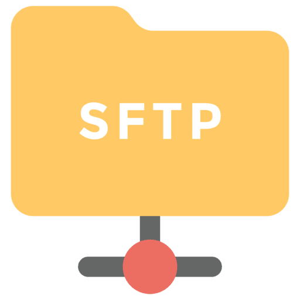| SFTP | ✅ Working |

### ETL Destinations

|                                                                   | Provider             | Status |
|-------------------------------------------------------------------|----------------------|---|
|        | Snowflake            | ✅ Working |
| 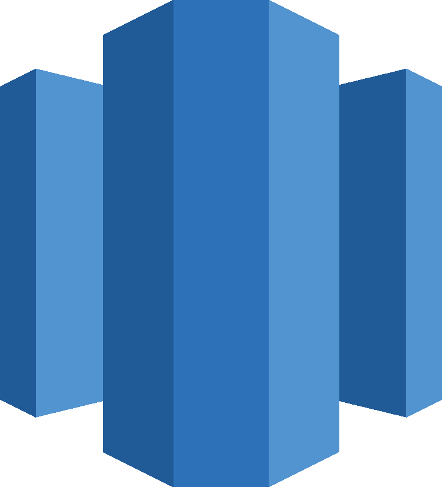 | Amazon Redshift      | ✅ Working |
|  | Google BigQuery      | ✅ Working |
|         | PostgreSQL           | ✅ Working |
|            | MySQL                | ✅ Working |
| 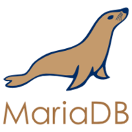         | MariaDB              | ✅ Working |
| 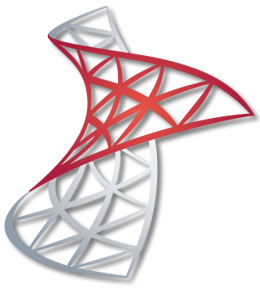          | Microsoft SQL Server | ✅ Working |
| 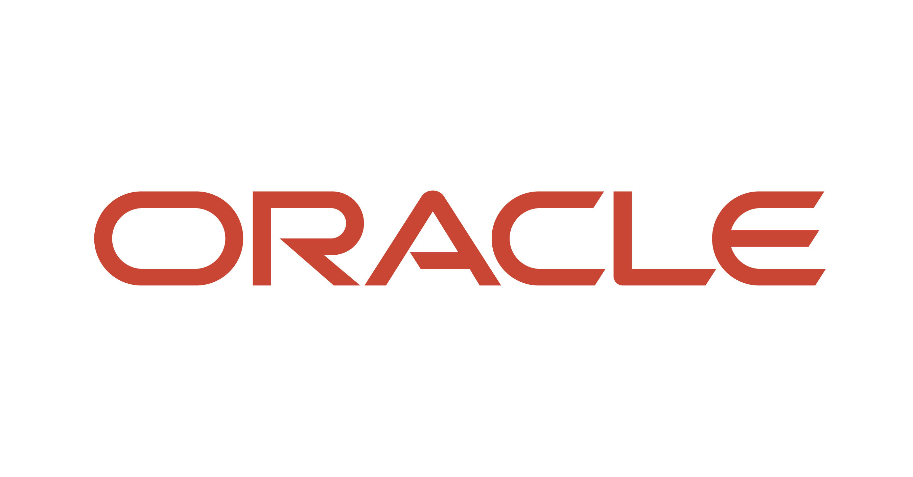          | Oracle               | ✅ Working |

## 🙌 Contributing

Contributions are welcome! Please see [CONTRIBUTING.md](CONTRIBUTING.md) for further details to get started easily.

## 👋 Join the LLM-powered automation community

- On Slack, [join great conversations](https://join-slack.unstract.com) around LLMs, their ecosystem and leveraging them to automate the previously unautomatable!
- [Follow us on X/Twitter](https://twitter.com/GetUnstract)
- [Follow us on LinkedIn](https://www.linkedin.com/showcase/unstract/)

## 🚨 Backup encryption key

Do copy the value of `ENCRYPTION_KEY` config in either `backend/.env` or `platform-service/.env` file to a secure location.

Adapter credentials are encrypted by the platform using this key. Its loss or change will make all existing adapters inaccessible!

## 📊 A note on analytics

In full disclosure, Unstract integrates Posthog to track usage analytics. As you can inspect the relevant code here, we collect the minimum possible metrics. Posthog can be disabled if desired by setting `REACT_APP_ENABLE_POSTHOG` to `false` in the frontend's .env file.
