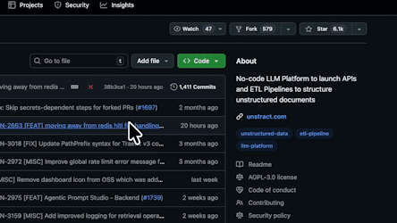
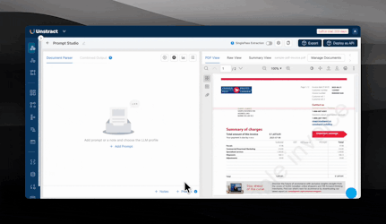

<div align="center">
  
  <h1>Unstract</h1>
  <h2>Turn Unstructured Documents into Structured Data</h2>
  <p>
    <a href="https://docs.unstract.com">Documentation</a> |
    <a href="https://unstract.com/start-for-free/">Cloud Edition</a> |
    <a href="https://unstract.com/pricing/">Enterprise</a> |
    <a href="https://join-slack.unstract.com">Slack Community</a>
  </p>
  <p>
    <a href="LICENSE"></a>
    <a href="https://docs.unstract.com/unstract/unstract_platform/quick_start"></a>
    <a href="https://status.unstract.com"></a>
    <a href="https://hub.docker.com/u/unstract"></a>
    <a href="https://deepwiki.com/Zipstack/unstract"></a>
    <a href="https://cla-assistant.io/Zipstack/unstract"></a>
  </p>
  <p>
    
    <a href="https://github.com/astral-sh/uv"></a>
    <a href="https://vite.dev/"></a>
    <a href="https://bun.sh/"></a>
    <a href="https://biomejs.dev/"></a>
  </p>
  <p>
    <a href="https://results.pre-commit.ci/latest/github/Zipstack/unstract/main"></a>
    <a href="https://sonarcloud.io/summary/new_code?id=Zipstack_unstract"></a>
    <a href="https://sonarcloud.io/summary/new_code?id=Zipstack_unstract"></a>
    <a href="https://sonarcloud.io/summary/new_code?id=Zipstack_unstract"></a>
  </p>
</div>

## What is Unstract?

Unstract uses LLMs to extract structured JSON from documents — PDFs, images, scans, you name it. Define what you want to extract using natural language prompts, and deploy as an API or ETL pipeline.

Built for teams in **finance**, **insurance**, **healthcare**, **KYC/compliance**, and much more.

## Current State vs. Unstract

| Task | Without Unstract | With Unstract |
|------|------------------|---------------|
| Schema definition | Write regex, build templates per vendor | Write a prompt once, handles variations |
| New document type | Days of development | Minutes in Prompt Studio |
| LLM integration | Build your own pipeline | Plug in any provider (OpenAI, Anthropic, Bedrock, Ollama) |
| Deployment | Custom infrastructure | `./run-platform.sh` or managed cloud |
| Output | Unstructured text blobs | Clean JSON, ready for your database |

> ⭐ If Unstract helps you, star this repo!
>
> 

## ✨ Key Features

**Prompt Studio** — Define document extraction schemas with natural language. [Docs →](https://docs.unstract.com/unstract/unstract_platform/features/prompt_studio/prompt_studio_intro/)



**API Deployment** — Send a document over REST API, get JSON back. [Docs →](https://docs.unstract.com/unstract/unstract_platform/api_deployment/unstract_api_deployment_intro/)


**ETL Pipeline** — Pull documents from a folder, process them, load to your warehouse. [Docs →](https://docs.unstract.com/unstract/unstract_platform/etl_pipeline/unstract_etl_pipeline_intro/)

**MCP Server** — Connect to AI agents (Claude, etc.) via Model Context Protocol. [Docs →](https://docs.unstract.com/unstract/unstract_platform/mcp/unstract_platform_mcp_server/)

**n8n Node** — Drop into existing automation workflows. [Docs →](https://docs.unstract.com/unstract/unstract_platform/api_deployment/unstract_api_deployment_n8n_custom_node/)

## 🚀 Quickstart (~5 mins)

### System Requirements & Prerequisites

- Linux or macOS (Intel or M-series)
- Docker & Docker Compose
- 8 GB RAM minimum
- Git

### Run Locally

```bash
# Clone and start
git clone https://github.com/Zipstack/unstract.git
cd unstract
./run-platform.sh
```

That's it!

- Visit [http://frontend.unstract.localhost](http://frontend.unstract.localhost) in your browser
- Login with username: `unstract` password: `unstract`
- Start extracting data!

## 📦 Other Deployment Options

### Docker Compose

```bash
# Pull and run entire Unstract platform with default env config.
./run-platform.sh

# Pull and run docker containers with a specific version tag.
./run-platform.sh -v v0.1.0

# Upgrade existing Unstract platform setup by pulling the latest available version.
./run-platform.sh -u

# Upgrade existing Unstract platform setup by pulling a specific version.
./run-platform.sh -u -v v0.2.0

# Build docker images locally as a specific version tag.
./run-platform.sh -b -v v0.1.0

# Build docker images locally from working branch as `current` version tag.
./run-platform.sh -b -v current

# Display the help information.
./run-platform.sh -h

# Only do setup of environment files.
./run-platform.sh -e

# Only do docker images pull with a specific version tag.
./run-platform.sh -p -v v0.1.0

# Only do docker images pull by building locally with a specific version tag.
./run-platform.sh -p -b -v v0.1.0

# Upgrade existing Unstract platform setup with docker images built locally from working branch as `current` version tag.
./run-platform.sh -u -b -v current

# Pull and run docker containers in detached mode.
./run-platform.sh -d -v v0.1.0
```

## 🔐 Backup Encryption Key

> [!WARNING]
> This key encrypts adapter credentials — losing it makes existing adapters inaccessible!

Copy the value of `ENCRYPTION_KEY` from `backend/.env` or `platform-service/.env` to a secure location.

## 🏗️ Unstract Architecture

```text
┌────────────────────────────────────────────────────────────┐
│                          Unstract                          │
├─────────────┬─────────────┬─────────────┬──────────────────┤
│  Frontend   │   Backend   │   Worker    │ Platform Service │
│  (React)    │  (Django)   │  (Celery)   │   (FastAPI)      │
├─────────────┴─────────────┴─────────────┴──────────────────┤
│                      Cache (Redis)                         │
├────────────────────────────────────────────────────────────┤
│                  Message Queue (RabbitMQ)                  │
├────────────────────────────────────────────────────────────┤
│                   Database (PostgreSQL)                    │
├────────────────────────────────────────────────────────────┤
│  LLM Adapters    │  Vector DBs    │  Text Extractors       │
│  (OpenAI, etc.)  │ (Qdrant, etc.) │  (LLMWhisperer)        │
└────────────────────────────────────────────────────────────┘
```

## 📄 Document File Formats

| Category | Formats |
|----------|---------|
| Documents | PDF, DOCX, DOC, ODT, TXT, CSV, JSON |
| Spreadsheets | XLSX, XLS, ODS |
| Presentations | PPTX, PPT, ODP |
| Images | PNG, JPG, JPEG, TIFF, BMP, GIF, WEBP |

## 🔌 Connectors & Adapters

### LLM Providers

| Provider | Status | Provider | Status |
|----------|--------|----------|--------|
| OpenAI | ✅ | Azure OpenAI | ✅ |
| Anthropic Claude | ✅ | Google Gemini | ✅ |
| AWS Bedrock | ✅ | Mistral AI | ✅ |
| Ollama (local) | ✅ | Anyscale | ✅ |

### Vector Databases

| Provider | Status | Provider | Status |
|----------|--------|----------|--------|
| Qdrant | ✅ | Pinecone | ✅ |
| Weaviate | ✅ | PostgreSQL | ✅ |
| Milvus | ✅ | | |

### Text Extractors

| Provider | Status |
|----------|--------|
| LLMWhisperer | ✅ |
| Unstructured.io | ✅ |
| LlamaIndex Parse | ✅ |

### ETL Sources & Destinations

**Sources:** AWS S3, MinIO, Google Cloud Storage, Azure Blob, Google Drive, Dropbox, SFTP

**Destinations:** Snowflake, Amazon Redshift, Google BigQuery, PostgreSQL, MySQL, MariaDB, SQL Server, Oracle

[Full Connector List](https://docs.unstract.com/unstract/unstract_platform/setup_accounts/whats_needed)

## 🛠️ Development

### Change Default Credentials

Follow [these steps](backend/README.md#authentication) to change the default username and password.

### Local Development

```bash
# Install pre-commit hooks
./dev-env-cli.sh -p

# Run pre-commit checks
./dev-env-cli.sh -r
```

[Local Development Guide](https://docs.unstract.com/unstract/unstract_platform/user_guides/run_platform)

## 🏢 Use Cases by Industry

[Finance & Banking →](https://unstract.com/finance-automation/) | [Insurance](https://unstract.com/insurance-automation/) → | [Healthcare →](https://unstract.com/healthcare-automation/) | [Income Tax →](https://unstract.com/ai-income-tax-forms-data-extraction/)

## ☁️ Cloud & Enterprise

For teams that need managed infrastructure, advanced accuracy features, or compliance certifications.

- ✅ **LLMChallenge** — dual-LLM verification
- ✅ **SinglePass & Summarized Extraction** — reduce LLM token costs
- ✅ **Human-in-the-Loop** — review interface with document highlighting
- ✅ **SSO & Enterprise RBAC** — SAML/OIDC integration with granular role-based access control
- ✅ **SOC 2, HIPAA, ISO 27001, GDPR Compliant** — third-party audited security certifications
- ✅ **Priority Support with SLA** — dedicated support team with response time guarantees

<a href="https://unstract.com/schedule-a-demo/"></a>

## 📚 Cookbooks

- [Unstract + PostgreSQL + DeepSeek](https://unstract.com/blog/open-source-document-data-extraction-with-unstract-deepseek/)
- [Unstract + n8n](https://unstract.com/blog/unstract-n8n/)
- [Unstract + Snowflake](https://unstract.com/blog/process-unstructured-data-with-unstract-snowflake/)
- [Unstract + BigQuery](https://unstract.com/blog/process-unstructured-data-with-unstract-bigquery/)
- [Unstract + Crew.AI](https://unstract.com/blog/agentic-document-extraction-processing-with-unstract-crew-ai/)
- [Unstract + PydanticAI](https://unstract.com/blog/building-real-world-ai-agents-with-pydanticai-and-unstract/)
- [Unstract MCP Server](https://unstract.com/blog/unstract-mcp-server/)

## 🤝 Contributing

We welcome contributions! The easiest way to start:

1. Pick an issue tagged [`good first issue`](https://github.com/Zipstack/unstract/labels/good%20first%20issue)
2. Submit a PR

[Report Bug →](https://github.com/Zipstack/unstract/issues/new?template=bug_report.md) | [Request Feature →](https://github.com/Zipstack/unstract/issues/new?template=feature_request.md)

## 👋 Community

Join the LLM-powered document automation community:

[](https://unstract.com/blog/) [](https://www.linkedin.com/showcase/unstract/) [](https://join-slack.unstract.com) [](https://twitter.com/GetUnstract)

## 📊 A Note on Analytics

Unstract integrates Posthog to track minimal usage analytics. Disable by setting `REACT_APP_ENABLE_POSTHOG=false` in the frontend's `.env` file.

## 📜 License

Unstract is released under the [AGPL-3.0 License](LICENSE).

---

<div align="center">
  <p>Built with ❤️ by <a href="https://zipstack.com">Zipstack</a></p>
  <p>
    <a href="https://unstract.com">Website</a> ·
    <a href="https://docs.unstract.com">Documentation</a> ·
    <a href="https://unstract.com/pricing/">Pricing</a>
  </p>
</div>
