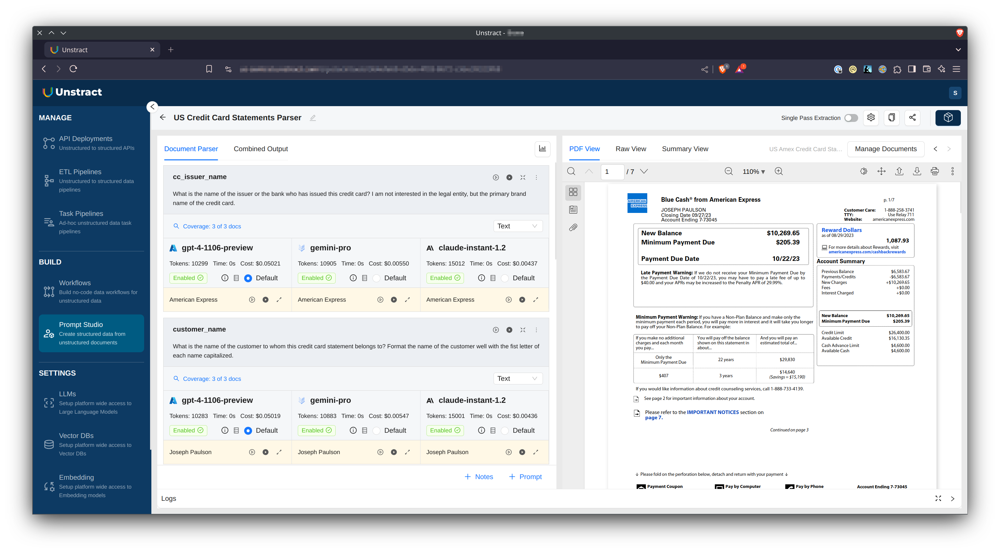
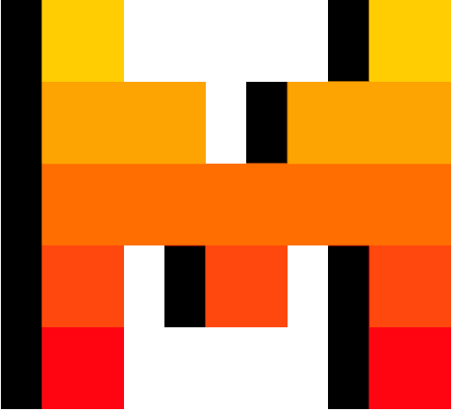
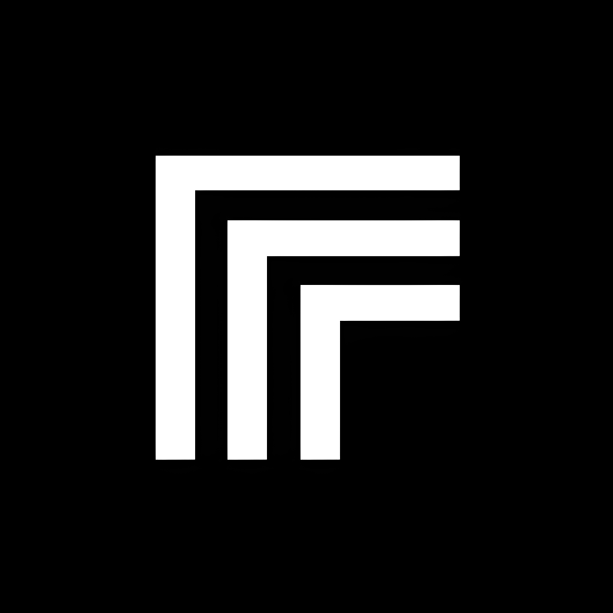
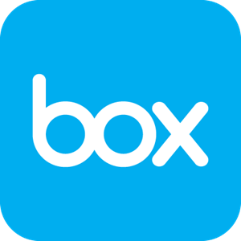

# Unstract

## Intelligent Document Processing 2.0 (IDP 2.0) Platform Powered by Large Language Models

#### No-code LLM Platform to launch APIs and ETL Pipelines to structure unstructured documents

## 

## 🤖 Prompt Studio

Prompt Studio's primary reason for existence is so you can develop the necessary prompts for document data extraction super efficiently. It is a purpose-built environment that makes this not just easy for you—but, lot of fun! The document sample, its variants, the prompts you're developing, outputs from different LLMs, the schema you're developing, costing details of the extraction and various tools that let you measure the effectiveness of your prompts are just a click away and easily accessible. Prompt Studio is designed for effective and high speed development and iteration of prompts for document data extraction. Welcome to IDP 2.0!

## 🧘‍♀️ Three step nirvana with Workflow Studio

Automate critical business processes that involve complex documents with a human in the loop. Go beyond RPA with the power of Large Language Models.

🌟 **Step 1**: Add documents to no-code Prompt Studio and do prompt engineering to extract required fields  
🌟 **Step 2**: Configure Prompt Studio project as API deployment or configure input source and output destination for ETL Pipeline 
🌟 **Step 3**: Deploy Workflows as unstructured data APIs or unstructured data ETL Pipelines!

## 🚀 Getting started

### System Requirements

- 8GB RAM (recommended)

### Prerequisites

- Linux or MacOS (Intel or M-series)
- Docker
- Docker Compose (if you need to install it separately)
- Git

Next, either download a release or clone this repo and do the following:

✅ `./run-platform.sh` 
✅ Now visit [http://frontend.unstract.localhost](http://frontend.unstract.localhost) in your browser  
✅ Use user name and password `unstract` to login

That's all there is to it!

See [user guide](https://docs.unstract.com/unstract_platform/user_guides/run_platform) for more details on managing the platform.  
Another really quick way to experience Unstract is by signing up for our [hosted version](https://us-central.unstract.com/).

## ⏩ Quick Start Guide

Unstract comes well documented. You can get introduced to the [basics of Unstract](https://docs.unstract.com/), and [learn how to connect](https://docs.unstract.com/unstract_platform/setup_accounts/whats_needed) various systems like LLMs, Vector Databases, Embedding Models and Text Extractors to it. The easiest way to wet your feet is to go through our [Quick Start Guide](https://docs.unstract.com/unstract_platform/quick_start) where you actually get to do some prompt engineering in Prompt Studio and launch an API to structure varied credit card statements!

## 🤝 Ecosystem support

### LLM Providers

|| Provider                                                       | Status                      |
|----------------------------------------------------------------|-----------------------------|---|
|        | OpenAI                      | ✅ Working |
|     | Google VertexAI, Gemini Pro | ✅ Working |
|  | Azure OpenAI                | ✅ Working  |
|          | Google PaLM                 | ✅ Working  |
|      | Anyscale                    | ✅ Working |
|    | Mistral AI                  | ✅ Working |
|     | Anthropic                   | ✅ Working |
|        | Ollama                      | ✅ Working |
|     | Replicate                   | 🗓️ Coming soon! |

### Vector Databases

|| Provider | Status |
|---|---|---|
|| Qdrant | ✅ Working |
|| Weaviate | ✅ Working |
|| Pinecone | ✅ Working |
|| PostgreSQL | ✅ Working |
|| Milvus | ✅ Working |

### Embeddings

|| Provider | Status |
|---|---|---|
|| OpenAI | ✅ Working |
|| Azure OpenAI | ✅ Working  |
|| Google PaLM | ✅ Working  |

### Text Extractors

|| Provider | Status |
|---|---|---|
|| Unstract LLMWhisperer | ✅ Working |
|| Unstructured.io Community | 🗓️ Coming soon!  |
|| Unstructured.io Enterprise | 🗓️ Coming soon!  |
|| LlamaIndex Parse | 🗓️ Coming soon! |

### ETL Sources

|| Provider | Status |
|---|---|---|
|| AWS S3 | ✅ Working |
|| Minio | ✅ Working |
|| Dropbox | ✅ Working |
|| Google Drive | 🗓️ Coming soon! |
|| Box | 🗓️ Coming soon! |
|| Google Cloud Storage | 🗓️ Coming soon! |
|| Azure Cloud Storage | 🗓️ Coming soon! |
|| HTTP/HTTPS | 🗓️ Coming soon! |

### ETL Destinations

|| Provider | Status |
|---|---|---|
|| Snowflake | ✅ Working |
|| Amazon Redshift | ✅ Working |
|| Google Bigquery | ✅ Working |
|| PostgreSQL | ✅ Working |
|| MySQL | 🗓️ Coming soon! |
|| MariaDB | 🗓️ Coming soon! |
|| Microsoft SQL Server | 🗓️ Coming soon! |

## 🙌 Contributing

Contributions are welcome! Please read [CONTRIBUTE.md](CONTRIBUTE.md) for further details on setting up the development environment, etc. It also points you to other detailed documents as needed.

## 👋 Join the LLM-powered automation community

- On Slack, [join great conversations](https://join-slack.unstract.com) around LLMs, their ecosystem and leveraging them to automate the previously unautomatable!
- [Follow us on X/Twitter](https://twitter.com/GetUnstract)
- [Follow us on LinkedIn](https://www.linkedin.com/showcase/unstract/)

## 🚨 Backup encryption key

Do copy the value of `ENCRYPTION_KEY` config in either `backend/.env` or `platform-service/.env` file to a secure location.  

Adapter credentials are encrypted by the platform using this key. Its loss or change will make all existing adapters inaccessible!  

## 📊 A note on analytics

In full disclosure, Unstract integrates Posthog to track usage analytics. As you can inspect the relevant code here, we collect the minimum possible metrics. Posthog can be disabled if desired by setting `REACT_APP_ENABLE_POSTHOG` to `false` in the frontend's .env file.
