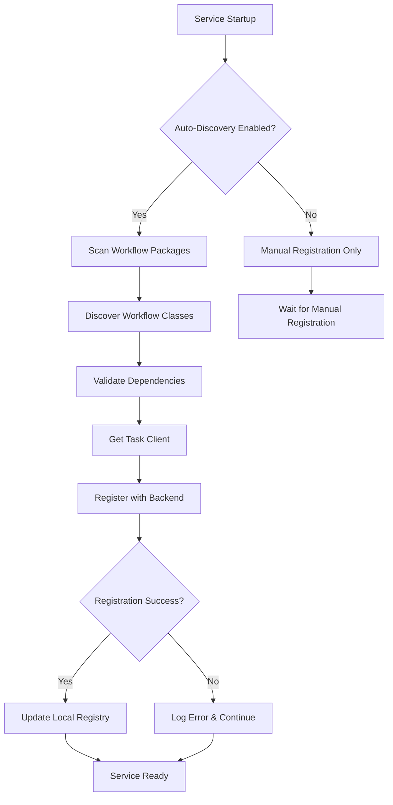

# Task Registration Strategy for Unstract Platform

## 🎯 **Overview**

This document outlines the comprehensive strategy for registering workflows and tasks across Unstract's microservices architecture using the new task abstraction layer.

## 📍 **Registration Locations by Service**

### **Prompt Service** 
```
prompt-service/src/unstract/prompt_service/workflows/
├── document_processing.py      # 6-stage document pipeline
├── llm_workflows.py           # LLM interaction workflows
├── extraction_workflows.py    # Data extraction tasks
├── validation_workflows.py    # Content validation workflows
└── __init__.py               # Auto-discovery logic
```

### **Backend (Django)**
```
backend/workflows/
├── user_workflows.py         # User management workflows
├── connector_workflows.py    # Database connector validation
├── pipeline_workflows.py     # Pipeline deployment workflows
└── __init__.py

backend/workflow_manager/     # New Django app for workflow management
├── apps.py                  # Django app config with workflow registration
├── management/commands/
│   └── workflow_registry.py # Management commands
└── workflows/
    ├── core_workflows.py
    └── __init__.py
```

### **Runner Service**
```
runner/src/unstract/runner/workflows/
├── execution_workflows.py    # Tool execution workflows
├── monitoring_workflows.py   # Pipeline monitoring tasks
├── resource_workflows.py     # Resource management workflows
└── __init__.py
```

### **Platform Service** 
```
platform-service/src/workflows/
├── auth_workflows.py        # Authentication workflows
├── tenant_workflows.py      # Multi-tenant management
└── __init__.py
```

## ⚙️ **Registration Mechanisms**

### **1. Service-Level Auto-Discovery**

Each service automatically discovers and registers workflows on startup:

```python
from unstract.task_abstraction.registry import register_service_workflows

# In service startup
await register_service_workflows(
    service_name="prompt-service",
    workflow_packages=["unstract.prompt_service.workflows"]
)
```

### **2. Integration Points**

**Flask Integration (Prompt Service):**
```python
# In Flask app factory
from unstract.task_abstraction.registry import register_flask_workflows

async def create_app():
    app = Flask(__name__)
    await register_flask_workflows(app)
    return app
```

**Django Integration (Backend):**
```python
# In Django apps.py
from unstract.task_abstraction.registry import register_django_workflows

class WorkflowManagerConfig(AppConfig):
    def ready(self):
        register_django_workflows(self, ["backend.workflows"])
```

### **3. CLI Management**

**Registration CLI:**
```bash
# Register all workflows for a service
python -m unstract.task_abstraction.registry \
    --service prompt-service \
    --backend hatchet \
    --validate

# Django management command
python manage.py workflow_registry --register --backend hatchet

# Test workflow execution
python manage.py workflow_registry --test --workflow user-onboarding
```

### **4. Environment Configuration**

**Backend Selection:**
```bash
# Core configuration
TASK_QUEUE_BACKEND=hatchet  # or celery, temporal, ingest

# Hatchet configuration
HATCHET_SERVER_URL=https://hatchet.unstract.localhost
HATCHET_TOKEN=your-token

# Celery configuration (fallback during migration)
CELERY_BROKER_URL=redis://localhost:6379
CELERY_RESULT_BACKEND=redis://localhost:6379
```

## 🔄 **Migration Strategy**

### **Phase 1: Parallel Deployment**
- Deploy abstraction layer alongside existing Celery
- Register new workflows while keeping Celery tasks
- Use `CeleryBridgeWorkflow` to call existing tasks from new workflows

### **Phase 2: Gradual Migration** 
- Convert Flask routes to workflow executions one by one
- Migrate Celery tasks to abstraction layer workflows
- Use feature flags to switch between implementations

### **Phase 3: Full Migration**
- Remove Celery dependencies
- Use Hatchet as primary backend
- Keep abstraction for future backend flexibility

## 📊 **Registration Flow**



## 🎛️ **Configuration Examples**

### **Prompt Service Configuration**
```python
# prompt-service/settings.py
WORKFLOW_SETTINGS = {
    'REGISTER_ON_STARTUP': True,
    'DEFAULT_BACKEND': 'hatchet',
    'WORKFLOW_PACKAGES': [
        'unstract.prompt_service.workflows',
        'unstract.prompt_service.processors',
    ],
    'VALIDATE_ON_REGISTRATION': True,
    'FAIL_FAST': False  # Continue if some workflows fail
}
```

### **Django Backend Configuration**
```python
# backend/settings.py  
INSTALLED_APPS = [
    # ... existing apps
    'backend.workflow_manager',  # New workflow management app
]

WORKFLOW_SETTINGS = {
    'REGISTER_WORKFLOWS_ON_STARTUP': True,
    'DEFAULT_TASK_BACKEND': 'hatchet', 
    'WORKFLOW_PACKAGES': [
        'backend.workflows',
        'backend.workflow_manager.workflows',
    ]
}
```

## 🚀 **API Integration Examples**

### **New Workflow-Based API Endpoints**

**Prompt Service:**
```python
@app.route("/api/v2/process-document", methods=["POST"])
async def process_document():
    client = get_task_client()
    result = await client.run_workflow(
        "document-processing-pipeline",
        request.get_json()
    )
    return jsonify({
        "workflow_id": result.workflow_id,
        "status": result.status.value
    })
```

**Django Backend:**
```python
@csrf_exempt
async def create_user_workflow(request):
    client = get_task_client()
    result = await client.run_workflow(
        "user-onboarding", 
        json.loads(request.body)
    )
    return JsonResponse({"workflow_id": result.workflow_id})
```

## 📋 **Operational Procedures**

### **Deployment Checklist**
- [ ] Set `TASK_QUEUE_BACKEND` environment variable
- [ ] Configure backend-specific credentials (Hatchet token, etc.)
- [ ] Verify workflow packages are in Python path
- [ ] Test workflow registration with CLI
- [ ] Validate workflow dependencies
- [ ] Check backend connectivity
- [ ] Monitor registration logs

### **Development Workflow**
1. Create workflow in appropriate service package
2. Use `@workflow` and `@task` decorators
3. Test locally: `python -m unstract.task_abstraction.registry --service X --test`
4. Verify registration: Check logs or use status command
5. Test API endpoints that use workflows

### **Troubleshooting**
- **Registration Failures**: Check logs for import errors, dependency issues
- **Backend Connectivity**: Verify credentials and network access
- **Validation Errors**: Use `--validate` flag to check workflow definitions
- **Import Issues**: Ensure workflow packages are in PYTHONPATH

## 🔍 **Monitoring and Observability**

### **Registration Status**
```python
# Check registration status
from unstract.task_abstraction import get_task_client

client = get_task_client()
workflows = client.get_registered_workflows()
print(f"Registered workflows: {len(workflows)}")
```

### **Health Checks**
```python
# Service health check
async def workflow_health_check():
    client = get_task_client()
    is_healthy = await client.health_check()
    return {"workflow_backend": "healthy" if is_healthy else "unhealthy"}
```

### **Metrics Collection**
- Track registration success/failure rates
- Monitor workflow execution times
- Alert on backend connectivity issues
- Log workflow dependency validation errors

## 🎯 **Benefits of This Strategy**

✅ **Microservices Aligned**: Each service owns its workflows  
✅ **Gradual Migration**: Support both old and new systems during transition  
✅ **Environment Driven**: Backend selection via configuration  
✅ **Development Friendly**: Auto-discovery, hot reload, CLI tools  
✅ **Production Ready**: Validation, health checks, monitoring  
✅ **Vendor Agnostic**: Easy switching between Hatchet, Celery, Temporal  

## 📈 **Next Steps**

1. **Immediate**: Implement registration for Prompt Service workflows
2. **Short Term**: Create Django workflow management app
3. **Medium Term**: Migrate existing Celery tasks to workflows
4. **Long Term**: Extend to Runner and Platform services

This strategy provides a comprehensive foundation for migrating Unstract from direct Celery usage to the flexible task abstraction layer while maintaining operational excellence.