# Unstract Platform Architecture

Unstract is a no-code platform that transforms unstructured documents into structured data using Large Language Models (LLMs). The platform allows business users to create document processing workflows without writing code, while providing the scalability and security needed for enterprise deployments.

## Architectural Principles

### 1. No-Code First: Democratizing Document Processing

The platform is designed around the principle that business users should be able to create sophisticated document processing workflows without technical expertise. This philosophy drives two key user interfaces:

```mermaid
graph LR
    subgraph "User Experience"
        PS[Prompt Studio<br/>Visual Laboratory]
        WS[Workflow Studio<br/>Production Pipelines]
    end
    
    subgraph "Three-Step Workflow"
        D[📄 Documents] --> PE[🧪 Prompt Engineering]
        PE --> AD[🚀 API/ETL Deployment]
    end
    
    PS --> PE
    WS --> AD
    
    style PS fill:#f0f8ff,color:#333333
    style WS fill:#f5f8f5,color:#333333
    style D fill:#fdf5e6,color:#333333
    style PE fill:#f8f5f8,color:#333333
    style AD fill:#fdf2f2,color:#333333
```



**Prompt Studio** serves as a visual laboratory where users experiment with and refine AI prompts. Rather than writing code, users upload sample documents, craft natural language prompts, and immediately see results. The studio provides real-time feedback, allowing users to iterate on their prompts until they achieve the desired extraction accuracy.

**Workflow Studio** transforms individual prompts into production-ready pipelines. Users drag and drop components to create workflows that can process thousands of documents, route data to different destinations, and handle error scenarios—all without writing a single line of code.

### 2. Security Through Best Practices: Zero Trust

Document processing often involves sensitive data, requiring a security model that assumes both external threats and internal component failures. Unstract implements defense in depth through multiple security best practices:

```mermaid
graph TB
    subgraph "Security Best Practices"
        MT[Encryption at Rest<br/>In-memory Data Processing]
        CT[Containerized Tools<br/>Least Privilege Sandbox]
        DR[Dynamic Resources<br/>Ephemeral Containers]
    end
    
    MT --> |Persistence Level| DE[(Database)]
    CT --> |Process Level| CR[Execution Environment Isolation]
    DR --> |Lifecycle| LC[Create → Execute → Destroy]
    
    style MT fill:#fdf0f0,color:#333333
    style CT fill:#faf0f5,color:#333333
    style DR fill:#f0f0f8,color:#333333
```



**In-memory Data Processing** ensures that sensitive data is not persisted permanently anywhere in the system, and is only accessible for a limited time after the processing is complete. Coupled with encryption at rest for connector credentials, your data is safely handled.

**Containerized Tool Isolation** treats every processing tool as potentially untrusted. Each tool runs in its own container with restricted permissions, limited resources, and no access to other tenants' data.

**Dynamic Resource Management** means containers are created only when needed and destroyed immediately after use. This "cattle, not pets" approach minimizes the attack surface and prevents resource accumulation over time.

### 3. Scalable Microservices: Growing Without Growing Pains


The platform is designed to scale from a single-user development environment to enterprise deployments processing millions of documents through a microservices architecture where each service has a single, well-defined responsibility.

## System Architecture: From 30,000 Feet

Unstract's architecture can be understood as four distinct layers, each serving a specific purpose in the document processing pipeline:


### Understanding the Four Layers

**The External Integrations Layer** represents the rich ecosystem of AI and data services that Unstract integrates with. Rather than building its own LLMs or vector databases, Unstract acts as an intelligent orchestrator, allowing users to leverage best-in-class services while abstracting away the complexity of direct integration.

**The Application Layer** houses the core platform services. This is where business logic lives, where user interfaces run, and where the coordination of document processing workflows occurs. Each service in this layer has a specific responsibility and communicates with others through well-defined APIs.

**The Persistence Layer** provides the foundational data services that every application needs: persistent storage, caching, message queuing, and file management. These services are shared across all application services and provide the reliability and performance characteristics needed for production deployment.

**The Tool Execution Layer** is where the actual document processing happens. This layer embodies security best practices—every processing operation runs in its own container, ensuring that failures are contained and security is maintained.

## Service Architecture: Each Component's Role

Unstract's microservices architecture divides responsibilities clearly, with each service handling a specific aspect of the document processing pipeline:


### Frontend Service
**Built with React 18 + Ant Design**  
**Ports**: 3000 (development), 80 (production via NGINX)

The Frontend service provides two main environments through a Single Page Application:
- **Prompt Studio**: Interactive development environment for AI prompts with real-time validation
- **Workflow Studio**: Drag-and-drop interface for creating production workflows

### Backend Service  
**Built with Django 4.2 + Django REST Framework**  
**Port**: 8000

The Backend service exposes the public API to interface with the platform:
- **Multi-tenant API** for dynamic resources management
- **Workflow Management** with dependency tracking and error handling
- **Authentication and Authorization** supporting OAuth2 and internal auth
- **Async Task Coordination** via Celery with multiple specialized queues

### Platform Service
**Built with Flask**  
**Port**: 3001

Acts as a controlled gateway for custom tools providing core services in the platform like connector authentication and usage tracking. This abstraction allows platform evolution without breaking existing tools.

### Prompt Service
**Built with Flask**

Encapsulates all LLM-related functionality via the SDK bridge:
- **Abstract LLM Providers**: Unified interface for OpenAI, Anthropic, Azure, etc.
- **Manage LlamaIndex Integration**: Document indexing and context retrieval
- **Handle Prompt Processing Pipeline**: Document preprocessing through result parsing

### Runner Service
**Built with Python + Docker API**  
**Port**: 5002

Manages tool container lifecycles with:
- **Dynamic Container Management**: Creates, configures, and manages execution
- **Security Enforcement**: Applies resource limits and privilege restrictions
- **Resource Cleanup**: Ensures proper termination and resource release
- **Kubernetes Compatibility**: Works with both Docker and Kubernetes

### Tool Sidecar
**Built with Python**

Provides monitoring without compromising isolation:
- **Streams Logs in Real-time** to Redis for debugging
- **Monitors Execution Health** detecting hangs and resource issues
- **Maintains Isolation** while providing platform integration

### X2Text Service
**Built with Flask**

Handles document format conversion to raw text by integrating with text extractors including LLMWhisperer, Unstructured.io, etc enabling independent scaling and failure isolation for this computationally expensive operation.

## Data Architecture: Where Information Lives and Flows

Unstract's data architecture employs different storage systems optimized for specific use cases:


### Database Design: PostgreSQL as the Foundation
**Primary Database**: PostgreSQL 14+ with pgvector extension

- **Schema-Based Multi-tenancy**: Multi-tenant schema where each tenant is represented by an organization
- **Vector Storage with pgvector**: Document embeddings stored alongside relational data
- **Migration Strategy**: Django manages schema evolution across all tenant schemas

### Message Queuing: Orchestrating Async Work
**Broker**: RabbitMQ  
**Task Processor**: Celery

Specialized auto-scaling queues handle different workload types:
- **`celery logs`**: High-throughput log streaming
- **`celery api deployments`**: API Deployment executions
- **`celery pipelines`**: Scheduled and manual ETL pipeline runs
- **`celery pipeline files`**: File processing for pipelines

### Caching & Sessions: Redis for Speed
Redis serves multiple performance-critical roles:
- **Session Management** with automatic expiration
- **Real-time Log Streaming** via pub/sub
- **Application Caching** for frequently accessed data
- **Rate Limiting** across multiple instances

### File Storage: S3-Compatible Object Storage
**Default**: MinIO (S3-compatible)  
**Abstraction**: Unified filesystem interface via `fsspec`

- **Tenant Isolation** through path prefixes
- **Storage Provider Flexibility** supporting various backends
- **Performance Optimization** with pre-signed URLs
- **Backup and Versioning** leveraging provider capabilities

## Tool Framework Architecture: Extensibility Through Standardization

The tool framework allows the platform to support tools written in any programming language while maintaining security:


### The Tool Contract: Language-Agnostic Standards

Every tool follows a standardized contract with a manifest describing capabilities:

```json
{
  "name": "text-extractor",
  "display_name": "PDF Text Extractor",
  "description": "Extracts text from PDF documents using OCR",
  "icon": "text-extractor-icon.svg",
  "input_types": ["application/pdf", "image/png", "image/jpeg"],
  "output_types": ["application/json"],
  "variables": {
    "ocr_language": {
      "type": "string",
      "default": "eng",
      "description": "OCR language code"
    }
  }
}
```

### Tool Execution Flow


#### 1. Registration & Discovery
When a tool is deployed to the platform, it announces its capabilities through a standardized manifest. The Runner Service discovers new tools by scanning container registries and validates their manifests. Each tool receives a unique identifier and its capabilities are indexed for quick lookup during workflow execution. This registration happens once per tool version, not per execution.

#### 2. Container Spawning
When a workflow needs to execute a tool, the Runner Service creates a fresh Docker container instance. This ephemeral container approach ensures:
- **Complete Isolation**: Each execution runs in its own environment with no shared state
- **Resource Limits**: CPU and memory constraints prevent runaway processes
- **Network Segmentation**: Tools cannot access other containers or internal services
- **Privilege Restrictions**: Containers run with minimal permissions, no root access

The spawning process takes milliseconds and includes injecting environment variables for platform authentication while keeping sensitive credentials encrypted.

#### 3. Input/Output Protocol
Tools communicate through a standardized JSON-based protocol over stdin/stdout:
- **Input Phase**: The platform sends document data and configuration as JSON
- **Processing Phase**: Tools process documents using their specialized logic
- **Output Phase**: Results are streamed back as structured JSON responses

This simple protocol allows tools written in any language to integrate seamlessly. The platform handles serialization, validation, and error boundaries, so tool developers focus solely on their processing logic.

#### 4. Real-time Monitoring
The Sidecar service attaches to each tool container to provide observability without compromising isolation:
- **Log Streaming**: Captures stdout/stderr and streams to Redis for real-time debugging
- **Health Checks**: Monitors CPU, memory usage, and execution time
- **Deadlock Detection**: Identifies and terminates hung processes
- **Progress Tracking**: Tools can emit progress events for long-running operations

This monitoring happens transparently—tools don't need special instrumentation. The platform automatically collects metrics and makes them available through the UI.

#### 5. Automatic Cleanup
After execution completes (successfully or with errors), the platform ensures thorough cleanup:
- **Container Termination**: The ephemeral container is destroyed immediately
- **Resource Release**: All allocated CPU, memory, and disk resources are freed
- **Temporary File Cleanup**: Any files created during execution are removed
- **Log Rotation**: Execution logs are compressed and archived per retention policies

This cleanup is guaranteed even if the Runner Service crashes—Kubernetes or Docker ensures orphaned containers are terminated. The "cattle, not pets" philosophy means no state persists between executions, eliminating entire classes of security vulnerabilities and resource leaks.

## Integration Architecture: Connecting to the AI Ecosystem

Unstract provides unified abstraction layers for integrating with AI and data services.

### LLM Provider Integration

The LLM integration layer is designed with provider agnosticism at its core—workflows can switch between providers without code changes, enabling cost optimization and failover strategies. The SDK abstracts provider-specific APIs, token limits, and response formats into a unified interface that handles retries, rate limiting, and error normalization transparently.


** *Single Pass/Summarization* and *Challenger* are Enterprise only features.


### Vector Database Integration

The vector database layer prioritizes flexibility in deployment scenarios—from pgvector for simple deployments to dedicated vector databases for high-scale operations. The design emphasizes efficient chunking strategies, smart embedding caching to reduce API costs, and hybrid search capabilities that combine semantic understanding with keyword precision for optimal document retrieval.


### ETL Connector Integration

The connector architecture follows a plugin-based design where each connector implements a standard interface, allowing new integrations without core platform changes. Security is paramount—credentials are encrypted at rest, authentication tokens are refreshed automatically, and all data transfers use secure protocols with audit logging for compliance requirements.


